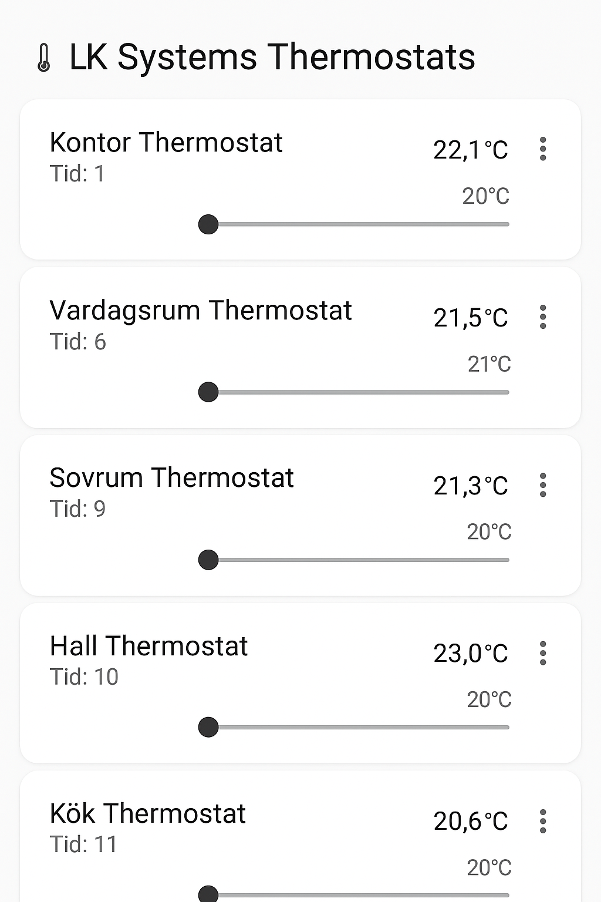

# LK Systems Integration for Home Assistant

This custom integration allows Home Assistant to interact with LK Systems thermostats through LK Systems webserver.

## Features

- Auto-detection of rooms from LK controller (webserver)
- Temperature sensors for each active room
- Climate entities for target control
- Full UI-based configuration with config flow
- No YAML required

## Installation via HACS

1. Go to HACS → Integrations → Custom Repositories
2. Add this repo URL and select `Integration` as category
3. Search for "LK Systems" in HACS and install
4. Reboot Home Assistant
5. Add integration through UI → "LK Systems"

## Support

Only tested with thermostats connected to LK Systems own controller (webserver). Requires access to the `/main.json` and `update.cgi` endpoints.

## Screenshots

## License

MIT
